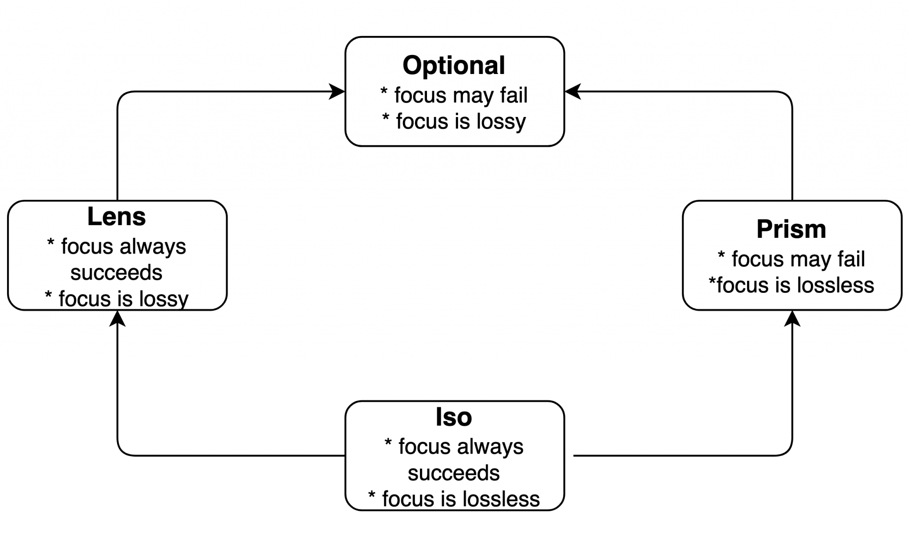
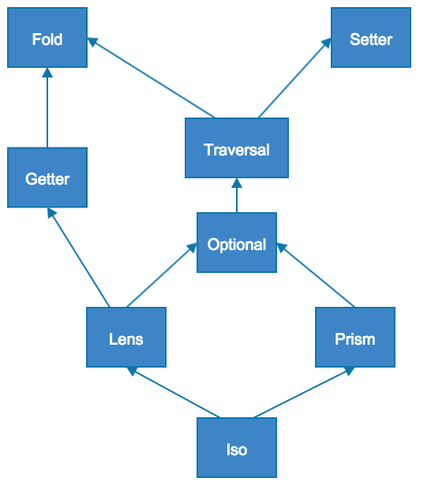
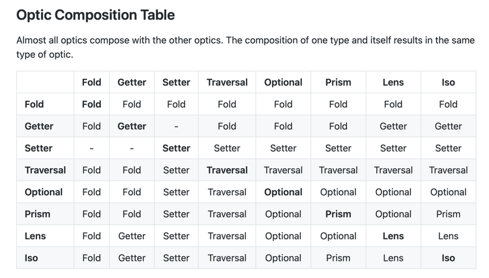

[](https://app.travis-ci.com/mtumilowicz/scala-optics-monocle-quicklens-workshop)
[](https://www.gnu.org/licenses/gpl-3.0)

# scala-optics-monocle-quicklens-workshop

* references
    * https://github.com/optics-dev/Monocle
    * https://www.optics.dev/Monocle/
    * https://www.baeldung.com/scala/monocle-optics
    * https://github.com/optics-dev/Monocle/tree/master/example/src/test/scala-2/monocle/function
    * [Monocle 3: A Peek into the Future by Julien Truffaut: Scala in the City Conference](https://www.youtube.com/watch?v=oAkiny6BzL0)
    * [Lenses, Prisms and Optics in Scala | Rock the JVM](https://www.youtube.com/watch?v=a09aBGccUTE)
    * https://blog.rockthejvm.com/lens/
    * [Scale By The Bay 2020: Julien Truffaut, Monocle 3: a peek into the future](https://www.youtube.com/watch?v=rT3tNV0xfbE)
    * https://medium.com/javascript-scene/lenses-b85976cb0534
    * [Mastering Optics in Scala with Monocle. Shimi Bandiel. ScalaUA2017](https://www.youtube.com/watch?v=fYMgdFrRtSU)
    * [Optics with Monocle - Modeling the Part and the Whole](https://www.youtube.com/watch?v=NvCcNM2vp3k)
    * [Data Juggling - Part 2 - Homegrown #Lenses (#Monocle - Part 1)](https://www.youtube.com/watch?v=rFixov5KOps)
    * [Data Juggling - Part 3 - Optics Explained (#Monocle - Part 2)](https://www.youtube.com/watch?v=18ss7LpAKWE)
    * [Data Juggling - Part 4 - #Quicklens (#Monocle - Part 3)](https://www.youtube.com/watch?v=1qHJ0H-2iOw)
    * https://github.com/softwaremill/quicklens
    * https://www.warski.org/blog/2015/02/quicklens-modify-deeply-nested-case-class-fields/
    * https://github.com/DevInsideYou/monocle-vs-quicklens
    * https://kubuszok.com/2018/adt-through-the-looking-glass/
    * https://www.scala-exercises.org/monocle
    * https://medium.com/zyseme-technology/functional-references-lens-and-other-optics-in-scala-e5f7e2fdafe
    * https://circe.github.io/circe/optics.html
    * https://scalac.io/blog/scala-optics-lenses-with-monocle/
    * https://dzone.com/articles/focus-on-your-data-structures-with-scala-lenses
    * https://github.com/falvarezb/blog-bytecode/blob/postLenses/src/test/scala/fjab/LensesTest.scala
    * https://circe.github.io/circe/optics.html
    * https://github.com/softwaremill/quicklens

## preface
* goals of this workshops
    * introduction to theoretical basis of optics
    * practice monocle and quicklens libraries
* workshop plan
    * provide implementation of `lib.Lens` and then use it in `VanillaOpticsSpec`
        * hint: use `lib.Getter` and `lib.Setter`
    * implement tests in `OpticsSpec` according to its names

## introduction
* problem: updating nested immutable objects
    * example
        ```
        sealed trait PaymentMethod
        object {
            case class PayPal(emai: String) extends PaymentMethod
            case class DebitCard(
                cardNumber: String,
                expirationDate: YearMonth,
                securityCode: Int
            ) extends PaymentMethod
        }

        case class User(name: String, address: Address, paymentMethod: PaymentMethod)
        case class Address(streetNumber: Int, postCode: String)

        val michal = User("michal", Address(12, "E16 4SR"), PaymentMethod.PayPal("a@gmail.com"))
        ```
    * updates of mutable objects (assume that above we have fields defined as `var`s)
        ```
        michal.address.streetNumber = 16
        ```
    * updated of immutable objects
        * using copy
            ```
            michal.copy(address = michal.address.copy(streetNumber = 16)
            ```
        * but how we will update enum?
            ```
            def updateExpiry(user: User, newExpiry: YearMonth): User =
                user.copy(paymentMethod =
                    user.paymentMethod match {
                        case card: DebitCard => card.copy(expirationDate = newExpiry)
                        case paypal: PayPal => paypal
                    }
            ```
        * or suppose we have `paymentMethods: Map[String, PaymentMethod]` instead of single `paymentMethod: PaymentMethod`
            ```
            val michal = User(
                "michal",
                Address(12, "E16 4SR"),
                Map(
                    "Personal" -> PayPal("mtu@gmail.com"),
                    "Business" -> DebitCard("", YearMonth.of(2022, 7), 995)
                )
            )

            def updateExpiry(user: User, paymentName: String, newExpiry: YearMonth): User =
                user.copy(paymentMethod =
                    user.paymentMethods.get(paymentName) match {
                        case None | Some(_: PayPal) => user.paymentMethods
                        case Some(card: DebitCard) =>
                            val updatedCard = card.copy(expirationDate = newExpiry)
                            user.paymentMethods.updated(paymentName, updatedCard)
                    }
            ```
* it would be nice if we could have something like OOP’s setters for immutable data structures
    * `.copy` is like that, but it doesn’t compose
    * lenses can be considered the functional representations of getters and setters
        ```
        case class Lens[A, B](get: A => B, set: (B, A) => A)
        ```
        and usage
        ```
        val articleTitleLens = Lens[Article, String](get = _.title, set = (t, a) => a.copy(title = t))
        ```
    * note that this boilerplate could be generated by macros

## use cases
* working with deeply nested JSON
    * example
        ```
        import io.circe._, io.circe.parser._

        val json: Json = parse("""
        {
          "order": {
            "customer": {
              "name": "Custy McCustomer",
              "contactDetails": {
                "address": "1 Fake Street, London, England",
                "phone": "0123-456-789"
              }
            },
            "items": [{
              "id": 123,
              "description": "banana",
              "quantity": 1
            }, {
              "id": 456,
              "description": "apple",
              "quantity": 2
            }],
            "total": 123.45
          }
        }
        """).getOrElse(Json.Null)
        ```
    * migrate one JSON format into the other without having to decode into the ADT
        ```
        import io.circe.optics.JsonPath._

        val _phoneNum = root.order.customer.contactDetails.phone.string
        // _phoneNum: monocle.package.Optional[Json, String] = monocle.POptional$$anon$1@367b3ec4

        val phoneNum: Option[String] = _phoneNum.getOption(json)
        ```
    * receive events/requests in the older format, check version, run all migrations to the current one
        * keep case classes and case objects only for the current schema
    * modifying json
        ```
        val doubleQuantities: Json => Json = root.order.items.each.quantity.int.modify(_ * 2)
        ```
* working with property based testing
    * introduction to property based testing: https://github.com/mtumilowicz/scala-zio2-test-aspects-property-based-testing-workshop
    * it is often easier to generate general complex object and then in test just change some fields according to needs
    * example
        ```
        val genAccount: Gen[Any, Account] = DeriveGen[Account]

        test("create locked account test") {
          check(genAccount) { account =>
            val lockedAccount = account.modify(_.details.alerting.locked).setTo(false)
            assertZIO(AccountService.createAccount(lockedAccount))(equalTo(AccountCreated(account.id)))
          }
        }
        ```
## lens
> A lens is a first-class reference to a subpart of some data type
> 
> School of Haskell

> any data accessor for a component of a data structure is ‘function-like’, in the sense that reading ‘consumes’
the component from the data structure and writing ‘produces’ an updated component to put back into the data structure.
The type structure of such function-like things — henceforth transformers — is technically known as a profunctor.
>
> Profunctor Optics Modular Data Accessors

* problem: how to implement Lens for a sum type?
    * with current implementation: impossible
        * there is no way to define getter
    * solution: partial lens (prism/optional in monocle)
        ```
        case class PartialLens[A, B](get: A => Option[B], set: (B, A) => Option[A])
        ```
* polymorphic lenses
    * lens construct focuses on a single field
    * what if we have multiple fields?
        * example: setting all the values in certain fields of a json
        * with current implementation: impossible
        * solution: val Laarhoven representation
            * we want to unify all functions
                ```
                get: S => A
                set: A => S => S
                modify: (A => A) => (S => S)
                modifyMaybe: (A => Option[A]) => (S => Option[S])
                modifyList: (A => List[A]) => (S => List[S])
                ```
            * generic representation the can support all features in the same type
                ```
                [F: Functor[_], S, T, A, B] // F ~ for example: Option, Collection
                modifyF: (f: A => F[B]): S => F[T]
                ```
    * when Optic is polymorphic additional two types come into play for "reverse" operation
        * example
            ```
            trait PLens[S, T, A, B] {
            	def get(s: S): A
            	def set(b: B)(s: S): T
            }
            ```
        * `B` for an argument and `T` for a result of that operation
    * `Traversal` is more generic than `Optional`
        * it composes with everything that `Optional` composes
        * it makes sense for all optics to have 4 type parameters (for S => T and A => B mappings)
            * this way we can always compose them
* laws
    * identity: if you get and then set back with the same value, the object remains identical
        ```
        lens.set(s, lens.get(s)) == s
        ```
    * retention: if you set with a value and then perform a get, you get the same value back
        ```
        lens.get(lens.set(s, a)) == a
        ```
    * double set — if you set twice in succession and then perform a get, you get back the last set value
        ```
        lens.get(lens.set(lens.set(s, a), b)) == b
        ```
    * example of breaking a law
        ```
        michal.focus(_.paymentMethods
            .*
            .as[DebitCard]
            .filter(_.expirationDate.isAfter(YearMonth.of(2020, 5))) // breaks the contract
            .expirationDate
            ).get

        val optic = Focus[User](_.paymentMethods
            .*
            .as[DebitCard]
            .filter(_.expirationDate.isAfter(YearMonth.of(2020, 5))) // breaks the contract
            .expirationDate

        val updated1 = optic.modify(michal, _.minusYears(2))
        val updated2 = optic.modify(update1, _.plusMonths(3)) // not works
        val updated3 = optic.modify(michal, _.minusYears(2).plusMonths(3)) // not the same result as updated1 + updated2
        ```


## optics
* based on Monocle
    * `ISO[S, A]`
        * converts elements of type `S` into elements of type `A` without loss
        * isomorphism between two types (bijection)
        * example
            * case class <-> tupleN
                ```
                case class Person(name: String, age: Int)
                ```
                * is equivalent to a tuple `(String, Int)`
                * tuple `(String, Int)` is equivalent to `Person`
            * collections: List <-> Vector
        * convenient to lift methods from one type to another
            * example: a `String` can be seen as a `List[Char]`
        * you can think of Iso as something that is simultaneously Lens and Prism
            * Lens: navigating from `S` to `A` is always successful
            * Prism: navigating from `A` to `S` does not need any additional information besides of A value
            * in other words: transformation from S to A is lossless
        * when is useful?
            * anytime when representing essentially the same data in different ways
            * example: physical units
                ```
                case class Meter(whole: Int, fraction: Int)
                case class Centimeter(whole: Int)

                val centimeterToMeterIso = Iso[Centimeter, Meter] { cm =>
                  Meter(cm.whole / 100, cm.whole % 100)
                }{ m =>
                  Centimeter(m.whole * 100 + m.fraction)
                }

                centimeterToMeterIso.modify(m => m.copy(m.whole + 3))(Centimeter(155))
                ```
    * `Prism[S, A]`
        * used for
            * sum type (coproduct)
                * example: sealed trait or Enum
            * when there is no 1-1 correspondence
                * example
                    * String - Int
                        * not all strings are transformable to Int, all Int transformable to String
                            * `String` <- `Int`
                            * `String` -> `Option[Int]`
                        * digression
                            * notice that `"0003".toInt == 3` but it is not reversible
                                * you have to put more constraint on String to have that example represents Prism
        * laws
            * if there is an answer, going back must give the source
            * if we go back, there must be an answer, which is the source
        * vs lens
            * sometimes fails to get target (Option) but you can always come back
    * `Optional[S, A]`
        * you may think of `Optional` as something more general than both `Prism` and `Lens`
            * `Prism`: the element A we are trying to focus may not exist
            * `Lens`: we don’t have enough information to go back to `S` without additional argument
            * summary: worst part of lens and prism - can fail to retrieve and can fail to get back
        * example
            * setup
                ```
                sealed trait Error

                case class ErrorA(message: String, details: String) extends Error
                case object ErrorB extends Error
                ```
            * task: `Optional[Error, String]` to "zoom into" details
                * cannot be `Lens[Error, String]` as `ErrorB` does not contain details
            * solution
                ```
                val getErrorADetails: Lens[ErrorA, String] = GenLens[ErrorA](_.details)
                val getErrorA: Prism[Error, ErrorA] = GenPrism[Error, ErrorA]
                val getDetails: Optional[Error, String] = getErrorA andThen getErrorADetails
                ```
        * it’s quite rare to see `Optional` implemented directly
            * usually: implement Prism and Lens and then compose them together
    * `Traversal[S, A]`
        * like optional that can focus on 0 to n fields
        * generalisation of an `Optional` to several targets
        * example: focus into all elements inside of a container (e.g. List, Vector, Option)
    * `At[S, I, A]`
        * an "index" I, provides a Lens[S, A]
        * built-in instances for map and set
        * Lens
    * `Index[S, I, A]`
        * like `At`
        * works on an optional index
        * built-in: list, map, string etc
        * Prism
        * can't delete the value under the key
* hierarchy (based on monocle)
    * diagram meant to be read as UML class hierarchy diagram
        * arrow going from `Lens` to `Optional` means that `Lens` is a special case of `Optional`
        * what does it mean that both `Lens` and `Prism` can be treated as `Optional`?
            * `Lens` is an `Optional` for which `getOption` always succeeds
            * `Prism` is an `Optional` for which we ignores `S` ("the whole part")
                * `A` ("the specific part") holds all information to produce new `S`
    * diagrams
    
    
    

## monocle
* composing
    ```
    val setStreetNumber = GenLens[Address](_.streetNumber)
    val setAddress = GenLens[User](_.address)
    val composed = setAddress andThen setStreetNumber

    composed.replace(newStreetNo)(user)
    ```
* focus
    * https://www.optics.dev/Monocle/docs/focus
        * Focus in scala 2 is much more limited. You can only using to generate lenses for fields inside a case class.
            * https://github.com/optics-dev/Monocle/issues/1329
    * example
        ```
        person
          .focus(_.address.street.name).modify(_.toUpperCase)
        ```

## quicklens
```
person
  .modify(_.address.street.name).using(_.toUpperCase)
  .modify(_.age).setTo(22)
  .modify(_.weight).setToIfDefined(Some(100))
  .modify(_.payments.each.result).using(_.toUpperCase)
  .modify(_.props.at("Height").value).setTo(178)
  .modify(_.pets.each.when[Dog].age).using(_ + 1)
```